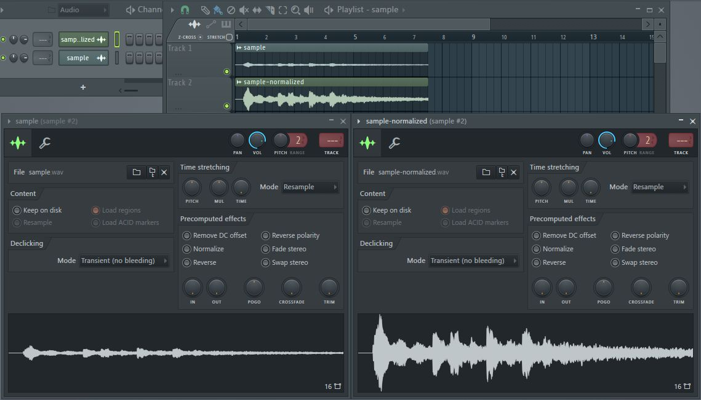

## Wav effector
Static effector for wav file

### init
```
bundle install
```

### run
```
ruby wav-effector.rb
```

### function
* Normalize  
Output normalized wav file as *[original-name]-normalized.wav* to same directory of the original.

Comparizon after normalized (right waveform) with original (left waveform).

