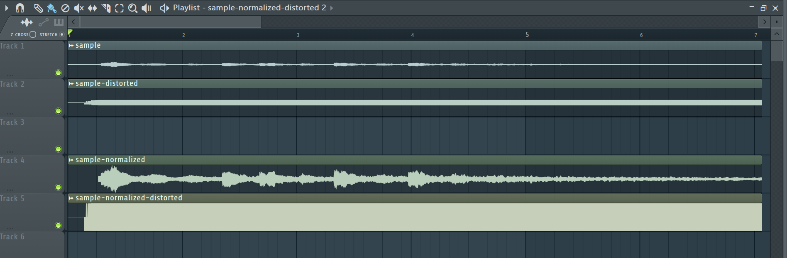

# Wav effector
Static effector for wav file

## init
```
bundle install
```

## run
```
ruby effector.rb
```

## function
* Normalize  
Output normalized wav file as *[original-name]-normalized.wav* to same directory of the original.

Comparizon after normalized (right waveform) with original (left waveform).


* Distortion(Fuzz effect)  
Output normalized wav file as *[original-name]-distorted.wav* to same directory of the original.

Comparizon after distorted (each bottom waveform) with original (each top waveform).

