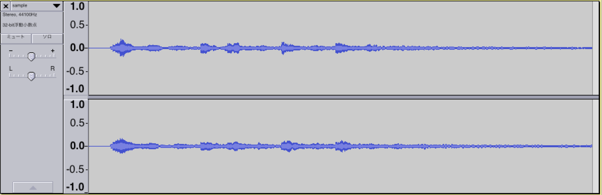

## はじめに

本記事内では波形の確認にフリーの非破壊サウンド編集ソフト、Audacityを使っていますが、あくまでも波形を表示するための一般的なツールとして用いているので、本稿ではソフトについての説明はしません。

## 環境と使用ライブラリ
```
$ ruby -v
ruby 2.2.3p173 (2015-08-18 revision 51636)
```

* wav-file (gem)

## Digital Audio Effect (DAFX conference)
```
DAFX is a acronym for digital audio effects. It is also the name for a European research project for co-operation and scientific transfer, namely EU-COST-G6 “Digital Audio Effects” (1997-2001).
```

DAFXのカンファレンスページ [LINK](http://www.dafx.de/) から引用。DAFXは簡単に言うとデジタル音声処理の学会のことです。様々な理論がこの学会で提唱され、色々な音声処理のソフトウェアに利用されています。
トップページには検索フォームと各年度毎に開催された学会の詳細ページへのリンクがずらっと並んでいます。


本稿では、この学会で実際に発表された理論を元に実装を進めていきたいと思います。

## 0. Normalization (正規化)
### 正規化とは？
通常はCD、ネット上に転がってる音源等ではピーク音量は **0dB** になっているはずですが、曲によっては **0dB** に満たない曲が存在します。そのような音源をAudacityで開いた場合、以下のような画面になります。



もちろん「音」を聞く分にはこのままでも問題無い（聞き手が音量を上げれば良い）のですが、
音量が異常に小さいと、例えば他の音と重ね合わせる際や別の音との音量差に気をつける必要があり、手間が少し増えます（聞いていた曲の音量が小さくて音量MAXにしていたら、次に流れた曲が異様に音圧の高い曲で、耳が殺られた経験されたことある方も居るのでは）
そのような場合、ピーク音量を **0dB** に合わせる事で音源の **正規化** を行う事が出来ます。
正規化を行うことにより、曲毎にバラバラな音量を整える事が出来るので聞きやすくなったりします。
例えば、上の音源を正規化すると、波形的には以下のようになります。


波形が増幅され、ピークの音量が0db(画面で言うと1.0ピッタリ)になるように調整されています。  
現在インターネット上に多く存在する効果音配布サイトやフリーの楽曲サイトでは、特別な理由が無い限り正規化済みのものが配布されていると思われるので、正規化についてはあまり考える必要も無いのですが、
今回はまず一番簡単な実装で、音声処理の取り掛かりとしてすぐ実現出来そうだったのでやってみます。

### 実装
使用しているライブラリで紹介した *wav-file* の[実行例](http://shokai.org/blog/archives/5408)にもある通り、波形を単純に半分（音量を半分）する時は以下のような形で実現できます。

```.rb
# 音量を半分にするプログラム
wavs = wavs.map{|w| w/2}
```

波形の正規化は、技術的には元のファイルの最大値(最小値)をファイルから読み取り、その最大値(最小値)をWAVファイルにおける最大値(最小値)になるように変更することで実現します。
つまり、以下のプログラムで波形データから最大値と最小値の絶対値を取得して、

このような形にすれば良さそうです。
その最大値と符号付きshortの最大値との比率を計算し、元の *wavs* 配列の要素をその比率分だけ倍にすれば良いので、実装は以下のように書けるでしょう。

```rb
SIGNED_SHORT_MAX = "111111111111111".to_i(2)

def get_peak(wavs)
  [wavs.max, wavs.min.abs].max
end

def normalize(wav_array)
  peak = get_peak(wav_array)
  wav_array.map{|data| data * (SIGNED_SHORT_MAX.to_f / peak)}.map(&:to_i)
end
```

get_peak関数では、最大値(最小値の絶対値)を求めて返却しています。
normalize関数では、引数で渡された波形配列をmapして、直前に取得したpeak値を元に順番に波形データを増幅し、その結果を新たな配列として返却しています。  
実行するには以下のようなプログラムを書けば良いでしょう。

```rb
f = open("input.wav")
format = WavFile::readFormat(f)
bit = format.bitPerSample == 16 ? 's*' : 'c*'
wavs = dataChunk.data.unpack(bit)

# normalize関数呼び出し
normalize(wavs)
```

## 1. Distortion (歪み)
### 1.1 エフェクトとしての「歪み」の種類
大きく分けてディストーションエフェクトにはDistortion、Fuzz、Overdriveの三つがあります。
三つの違いは明確なものがなく、実装する側が定義するので違いが現れることもありますが、今回の実装ではDAFXの論文に載っている定義を元に実装しました。  
最初に、ディストーションはstatic characteristic curve(特徴グラフ)と呼ばれるもので表現されます。DAFXに記載されている論文、「」を見てみると、
* Distortion  
指数的に滑らかに増幅

* Fuzz  
一定の値を区切りに出力を固定又は増幅

* Overdrive  
ある一定の値を超えた所で極端に増幅

と行った特徴があります。このグラフだけでは分かりにくいので、自分が普段使っているDAWのFL Studio12 を利用して実際にエフェクトを付与する前と後で波形の変化を確認してみました。  
確認に使ったプラグインは、 *Fruity Wavshaper* です。

* Distortion

* Fuzz

* Overdrive


### 1.2 Distortion
Distortionエフェクトの数式での定義は以下になります。


この数式が示すグラフは以下のようになります。

```rb
def distort(peak)
    @wavs.map{|data|
      sgn(data) * (1.0 - Math.exp((-1.0) * data.abs)) * peak.to_f
    }
end
```

### 1.3 Fuzz
#### 1.3.1 説明
Fuzzという単語には「毛羽立った」という意味があり、その意味の通り原音を過剰に歪ませるエフェクトになります。
今回実装する歪み系エフェクトの中ではもっとも歴史が古く、過去のジミ・ヘンドリックスを始めとする偉大なギタリスト達が、強烈な音を求めた末に編み出した音でした。
技術的な説明をすると、アンプに過剰な入力を与えることによって発生する原音には無い倍音を付加させるエフェクトです。
しかしこの手法では、アンプに対して想定されていないような過剰な負荷をかけて演奏することになるので、アンプの機材の寿命を著しく縮めます。
そこで登場したのが意図的に過剰な歪みを発生させるエフェクター、Fuzz faceでした。
今回はDAFXの論文に従って、模擬的なFuzzエフェクトを発生させてみます。

#### 1.3.2 実装
今回実装するFuzzエフェクトの数式での定義は以下になります。

```rb
def fuzz(peak, dist, q)
  @wavs.map{|data|
    data == (q * peak).to_i ? (((1.0/dist) + q*peak / 1 - Math.exp(dist * q*peak))).to_i : (((data - q*peak) / (1 - Math.exp((-1) * dist * (data - q*peak)))) + (q*peak / (1 - Math.exp(dist * q*peak)))).to_i
  }
end
```

### 1.4 Overdrive
#### 1.4.1 説明
オーバードライブは【アンプのボリュームを上げ出力電圧を加えて回路が飽和して出力音が歪んでしまう】状態のことで、もともとは1950年代当時のクリーントーンしか出なかったギターアンプのボリュームを上げすぎた時に偶然見つかった現象でした。エフェクターのオーバードライブはこの歪みを意図的にシミュレーションしたもので、回路内にクリッピングのダイオードを使用します。(引用)
今回はプログラム上で、数式で表現されたオーバードライブエフェクトを実現します。

#### 1.4.2 実装
Overdriveの特徴グラフを示す数式を見てみると、以下のようになります。


数式だけでみるとわかりにくいので、実際この数式がどのような特徴グラフを描くのか見てみましょう。

```rb
def overdrive(peak)
  @wavs.map{|data|
    case data.abs
    when 0..@threshold then
      2.0 * data
    when (@threshold + 1)..(@threshold * 2) then
      (3.0 - (2.0 - 3.0 * data) ** 2.0) / 3.0
    when (@threshold * 2 + 1)..(peak) then
      peak
    end
  }.map(&:to_i)
end
```

## まとめ
この記事はAIZU AVENT CALENDAR 2016 で書いた記事から発展して取り組んだ内容になりました。
今までサウンドプログラミングには全く触れてきませんでしたが、趣味と自分の大学生活で身につけた技術双方を取り入れる事が出来てとても楽しかったです。
論文については専門外なので論文を書くことは無いでしょうが、論文を読む良い練習にもなりました（この記事を出す頃にはとっくに卒論は書き終わってますが…）
これからも興味のある論文を見付けたら積極的に読み、可能であれば実装していきたいと思います。

これは余談ですが、DAFXの各年度の学会のページを眺めてみると、載っている学会のスポンサー企業がすごい豪華でした。(この中で自分はiZotope社のプラグインを愛用しているのでとても驚きました)  
この学会で発表された理論を元に、自分の手元にあるプラグインが作られているのかと考えると、なかなか興味深いです。今後も色々と調べて行きたいですね。


## 参考
* [橋本商会 >> wavファイルをRubyで編集する](http://shokai.org/blog/archives/5408)  
* [音量の正規化(ノーマライズ:normalize)](http://www.web-sky.org/program/normalize.html)
* [DAFX](http://www.dafx.de/)
